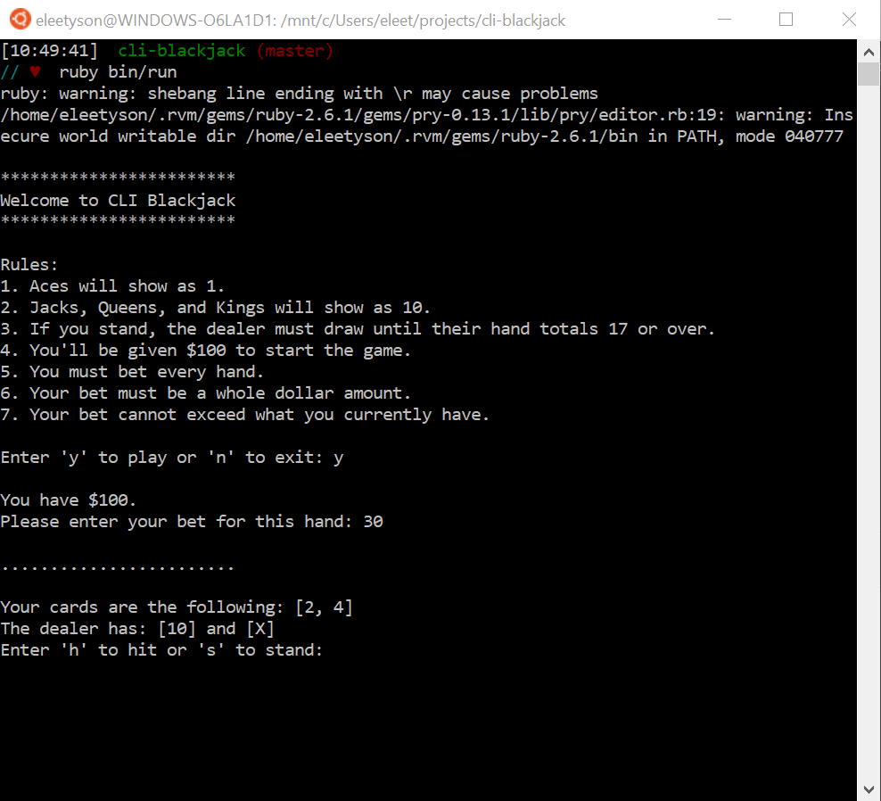

### CLI Blackjack
This is a CLI app that allows a user to play Blackjack from the command line, using their terminal and shell.

It's built entirely with Ruby and uses this [Deck of Cards API](https://deckofcardsapi.com/).

To play, follow the steps below:
1. Fork [this repository](https://github.com/eleetyson/cli-blackjack) and create a clone of your fork (meaning, make a copy of these files and download to your computer -- [Github's guide](https://docs.github.com/en/github/getting-started-with-github/fork-a-repo#propose-changes-to-someone-elses-project) explains this process well)
2. Ensure you have Ruby and these two gems, "pry" and "httparty", installed on your computer
```
# Check all gems you have installed
gem list
# Check for a specific gem with a regex -- will return true if you've installed the gem already
gem list -i "^insert_gem_name$"
# Run the following lines, one at a time, to install "pry" and "httparty" gems
gem install pry
gem install httparty
```
3. Navigate to the newly created `<cli-blackjack>` directory
4. Run `<ruby bin/run>`
5. Good luck!


